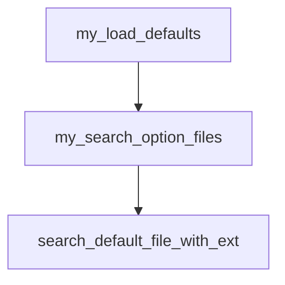
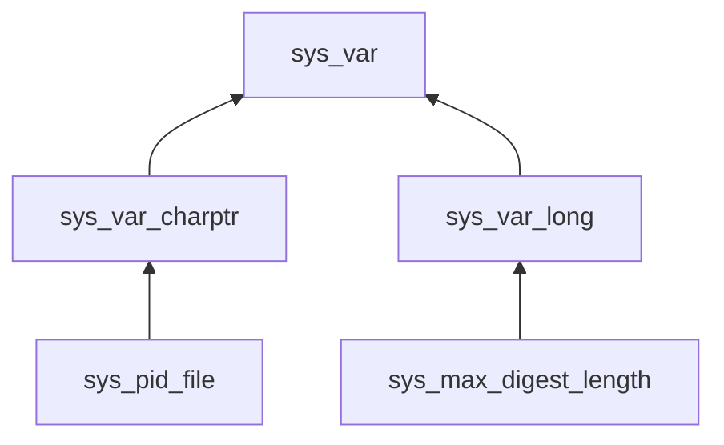

- [[#**加载my.cnf：**|**加载my.cnf：**]]
- [[#初始化参数|初始化参数]]

# my.cnf
文件位置：`mysql --help | grep "my.cnf"` 获取mysql查询my.cnf的顺序。
文件格式：典型的ini文件格式， `key = value`
源码中的处理：
## **加载my.cnf：**

innodb参数：
问题：
参数保存位置：`mysqld.h/cc`中声明和定义了使用到的global的全局变量，如：`global_system_variables`, `max_connect_errors`。`all_sys_vars`保存了对应的指针
```C++
struct sys_var_chain  
{  
  sys_var *first;  
  sys_var *last;  
};
```

```C++
static Sys_var_ulong Sys_max_connect_errors(  
       "max_connect_errors",  
       "If there is more than this number of interrupted connections from "  
       "a host this host will be blocked from further connections",  
       GLOBAL_VAR(max_connect_errors), CMD_LINE(REQUIRED_ARG),  // 将max_connect_errors 的地址放入了 sys_var中
       VALID_RANGE(1, ULONG_MAX), DEFAULT(100),  
       BLOCK_SIZE(1));
```

## 初始化参数
在`my_handle_options`中将argc、argv中的值设置到all_sys_vars中。
这里不再继续深究mysql的配置初始化及设置，主要原因是mysql本身代码特别烂，读起来特别费劲。。。
## 编译参数设置
编译输出路径在哪设置的？为什么是 ~/sql/mysqld
为什么初始密码是12345678？
# 日志路径
error_log：`log-error = path`
slow-query_log：`slow_query_log_file = path`

