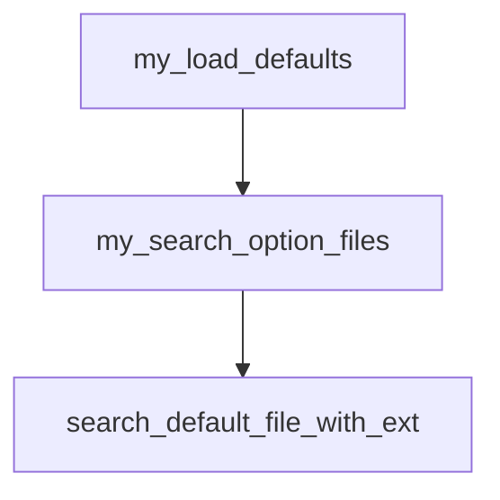

### my.cnf
文件位置：`mysql --help | grep "my.cnf"` 获取mysql查询my.cnf的顺序。
文件格式：典型的ini文件格式， `key = value`
源码中的处理：

```mermaid
graph TD

	my_load_defaults --> my_search_option_files

	my_search_option_files --> search_default_file_with_ext
	
```
innodb参数：
问题：
1. 参数保存在哪里？
2. 参数如何动态设置和取出？